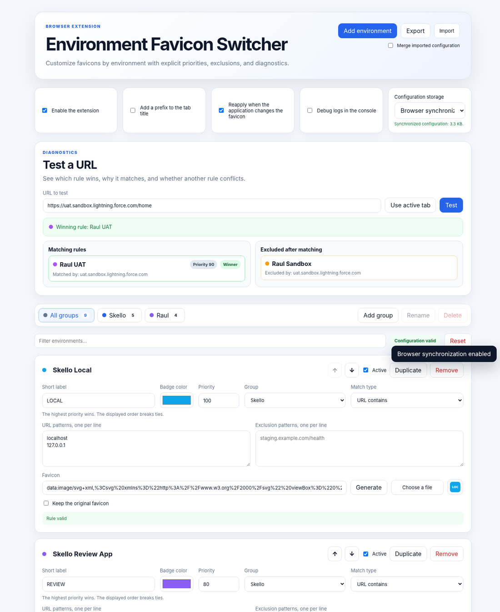

# 🌍 Environment Favicon Switcher

**Environment Favicon Switcher** is a Manifest V3 browser extension that makes local, review, sandbox, staging, and production tabs immediately distinguishable.

It can replace a page favicon, add a toolbar badge, and optionally prefix the tab title, while keeping all URL matching and configuration logic inside the browser.



## ✨ Features

### 🔎 Environment detection and rule management

- Automatically detects the active environment from the current page URL.
- Provides a configurable options page, allowing rules to be managed without code changes.
- Supports adding, editing, duplicating, deleting, filtering, grouping, and reordering environments.
- Uses deterministic rule selection based on explicit priorities, with stable order-based tie-breaking.
- Supports exclusion patterns to define exceptions within broader matching rules.
- Includes configurable default environments in `config/defaults.js`.

### 🔗 URL matching

- Four matching modes are available: **URL contains**, **Domain or subdomain**, **URL glob patterns** using `*` and `?`, and **regular expressions**.
- An interactive URL tester helps validate rules and explains which rule wins, which rules conflict, which exclusions are applied, and which patterns are invalid.

### 🎨 Visual environment indicators

- Displays the detected environment in the browser toolbar badge.
- Can prefix the tab title, for example: `[STAGING] MyApp`.
- Supports custom favicons from local extension paths, remote HTTPS URLs, imported image files, or generated SVG icons based on a label and color.
- Can preserve the website's original favicon, which is particularly useful for production environments.
- Automatically reapplies the managed favicon and title prefix after SPA navigation or page updates.
- Preserves page-owned favicon elements and restores the original application title when a rule no longer matches.

### 🧭 Browser controls

- Includes a browser toolbar popup showing the detected environment, current status, and winning rule for the active tab.
- Allows the extension to be enabled or disabled globally.

### 💾 Configuration, import, and synchronization

- Supports versioned JSON configuration import and export.
- Provides both replace and merge import strategies.
- Supports optional browser synchronization with data chunking, integrity checks, local backups, and automatic fallback.

### 🌐 Internationalization

- Includes English and French user interfaces.

### ✅ Quality and delivery

- Includes dependency-free automated tests and static validation.
- Provides deterministic packaging.
- Includes a GitHub Actions continuous integration workflow.

## 🛠️ Install for development

### Chrome, Chromium, Brave, or Edge

1. Clone or extract the repository.
2. Open `chrome://extensions`.
3. Enable **Developer mode**.
4. Select **Load unpacked**.
5. Choose the repository directory containing `manifest.json`.
6. Open the toolbar popup and verify that the extension loads correctly.

### Firefox

1. Clone or extract the repository.
2. Open `about:debugging#/runtime/this-firefox`.
3. Select **Load Temporary Add-on**.
4. Choose `manifest.json`.
5. Open the toolbar popup and verify that the extension loads correctly.

> [!NOTE]
> Firefox removes temporary extensions when the browser restarts. Permanent distribution normally requires a package signed through Firefox Add-ons.

> [!IMPORTANT]
> Browser-internal pages such as `chrome://extensions` and `about:addons` do not allow normal content-script injection.

## ⚙️ Configure an environment

Open the toolbar popup and select **Configure**. Each rule contains:

| Field                     | Purpose                                                                                     |
| ------------------------- | ------------------------------------------------------------------------------------------- |
| **Name**                  | Human-readable environment name.                                                            |
| **Short label**           | Toolbar badge and optional title-prefix text.                                               |
| **Badge color**           | Environment color and generated favicon background.                                         |
| **Priority**              | Higher values win when several rules match. Values are normalized between `-999` and `999`. |
| **Group**                 | Optional project or team grouping.                                                          |
| **Match type**            | How inclusion and exclusion patterns are interpreted.                                       |
| **URL patterns**          | Inclusion patterns, one per line. At least one must match.                                  |
| **Exclusion patterns**    | Exceptions, one per line. Any match vetoes the rule.                                        |
| **Favicon**               | Bundled path, HTTPS URL, or image data URL.                                                 |
| **Keep original favicon** | Keeps detection, badge, and title behavior without replacing the site favicon.              |

Rules can be moved up or down. Display order is only used when matching priorities are equal.

## 🧩 Matching behavior

| Mode                   | Behavior                                                                                    | Example                           |
| ---------------------- | ------------------------------------------------------------------------------------------- | --------------------------------- |
| **URL contains**       | Case-insensitive substring search across the complete URL.                                  | `staging.example.com`             |
| **Domain / subdomain** | Exact hostname or a true subdomain; `notexample.com` does not match `example.com`.          | `example.com`                     |
| **URL glob**           | Case-insensitive full-URL match where `*` spans any characters and `?` spans one character. | `https://review-*.example.com/*`  |
| **Regular expression** | Case-insensitive JavaScript regular expression, limited to 1,000 characters per pattern.    | `https://pr-[0-9]+\.example\.com` |

For every URL, the engine evaluates all enabled rules, applies exclusions, sorts matches by descending priority, and then uses configuration order as the final tie-breaker.

The options-page tester exposes the same evaluation result used by the content script and popup.

### Example: broad sandbox rule with a UAT exception

```text
Name: Sandbox
Priority: 50
Match type: URL contains
Include:
sandbox.example.com

Exclude:
uat.sandbox.example.com
```

A separate UAT rule can then use priority `90`, making the intended result explicit rather than dependent on accidental list order.

## 🖼️ Favicons

A rule can use:

- a bundled path such as `icons/favicon-staging.ico`;
- a user-provided HTTPS image URL;
- an imported image stored as a data URL, up to 128 KiB;
- a generated SVG favicon created from the rule label and color.

The extension adds one managed `<link rel="icon">` element and leaves the page's existing favicon elements untouched.

When a rule stops matching or the extension is disabled, only the managed element is removed. For production rules, **Keep original favicon** is usually the safest choice.

Remote images are requested by the browser from the configured URL. Bundled or generated favicons are more reliable and avoid that external request.

### 📁 Local extension path

```text
icons/favicon-staging.png
```

This is the recommended option for stable configurations shared in the source repository. The referenced file must be included in the extension package.

### 🌐 Remote URL

```text
https://example.com/favicon-staging.png
```

The URL must remain publicly accessible and should use HTTPS. Remote resources may be affected by authentication requirements, availability, or browser security policies.

### 📥 Imported file

Choose an image from the options page. The file is converted into a data URL and stored in the extension configuration. Imported images do not become source files and may increase the size of synchronized settings.

### 🧪 Generated favicon

The options page can generate a compact SVG favicon from the rule label and badge color. Generated icons are well suited to synchronized configurations because they are usually smaller than imported bitmap images.

## 🩺 URL diagnostics

The **Test a URL** panel can use a pasted URL or the active tab. It reports:

- the winning rule and matched pattern;
- every additional matching rule and priority conflict;
- rules that matched an inclusion but were vetoed by an exclusion;
- malformed regular expressions and missing rule data;
- whether the extension is globally disabled.

This makes broad rules and precedence errors visible before they affect real tabs.

## ☁️ Local and synchronized storage

Local storage is the default. Browser synchronization can be enabled from the options page.

Synchronized settings are serialized in UTF-8, split into quota-safe chunks, protected by a checksum, and limited to 80 KiB. A complete local copy is kept as a backup. If synchronization is unavailable, corrupt, or over the configured size limit, the extension falls back to the local copy and shows the reason in the options page.
Synchronization is provided by the browser account. Enabling it may copy rule names, URL patterns, and embedded favicon data to the browser vendor's synchronization service. No project-owned server is involved.

Large imported favicons can make a configuration unsuitable for synchronized storage. Generated SVG favicons are compact and generally preferable for synchronized profiles.

## 📤 Import and export

Exports use a versioned envelope:

```json
{
  "format": "environment-favicon-switcher",
  "version": 1,
  "exportedAt": "2026-07-17T00:00:00.000Z",
  "settings": {}
}
```

Legacy raw settings objects remain importable.
Unknown envelope versions and malformed payloads are rejected.
Imports can replace the complete configuration or merge groups and rules by stable IDs. Import files are limited to 2 MiB.

## 🧱 Default configuration

Default groups and environments are defined in:

```text
config/defaults.js
```

This file is used to initialize new installations and can provide a shared starter configuration for a team. Existing users normally keep the configuration already stored by the browser, so changes to `defaults.js` may not become visible automatically. When a fresh initialization is required, you can reset the configuration from the options page, import an updated JSON file, or clear the extension storage.

## 🔄 Runtime behavior

The content script:

1. loads normalized settings;
2. diagnoses the current URL and selects the deterministic winner;
3. applies a managed favicon and optional title prefix;
4. watches SPA history changes, relevant favicon mutations, and application title updates;
5. reacts to local or synchronized storage updates;
6. sends a compact status message for the toolbar badge and popup.

Application-owned favicons are never deleted or disabled.

The title prefix tracks subsequent SPA title changes and restores the latest application title when no longer active.

## 👩‍💻 Development

Node.js 20 or newer is required for repository tooling. The extension itself has no runtime package dependency.

```bash
npm ci
npm run validate
npm run package:extension
```

Available commands:

| Command                     | Result                                                                                                                                          |
| --------------------------- | ----------------------------------------------------------------------------------------------------------------------------------------------- |
| `npm test`                  | Runs the Node test suite for matching, migration, imports, and synchronized storage.                                                            |
| `npm run lint`              | Checks JavaScript syntax, JSON, manifest references, HTML assets, locale parity, translation keys, unsafe DOM sinks, and default-rule validity. |
| `npm run validate`          | Runs static validation and all tests.                                                                                                           |
| `npm run package:extension` | Creates a deterministic runtime-only ZIP in `dist/`.                                                                                            |
| `npm run build`             | Validates, tests, and packages the extension.                                                                                                   |

The package task uses a fixed timestamp and sorted file order, so identical sources produce an identical archive and SHA-256 digest.

## 🗂️ Project structure

```text
.
├── .github/workflows/ci.yml    # Validation, tests and packaged artifact
├── _locales/                   # English and French messages
├── config/defaults.js          # Initial schema-v2 settings
├── docs/                       # Architecture and UI preview
├── icons/                      # Bundled extension and environment icons
├── scripts/                    # Static validation and deterministic ZIP builder
├── src/
│   ├── background.js           # Badge state and runtime messages
│   ├── content.js              # Page lifecycle, favicon and title management
│   ├── i18n.js                 # DOM localization helper
│   ├── options.js              # Rule editor, diagnostics, import/export and sync UI
│   ├── popup.js                # Active-tab diagnosis and controls
│   ├── service-worker.js       # Chromium MV3 entry point
│   └── shared.js               # Rule engine, schema and storage abstraction
├── tests/                      # Dependency-free Node tests
├── manifest.json
├── options.html
└── popup.html
```

See [Architecture](docs/ARCHITECTURE.md) for data flow, invariants, and storage details.

## 🔐 Permissions

The extension requests the following permissions:

- `storage`: saves settings locally and, when enabled, through browser synchronization.
- `tabs`: lets the popup read the active tab URL and update toolbar state.
- `activeTab`: supports explicit interaction with the selected tab.
- `<all_urls>`: lets the content script evaluate user-defined rules on arbitrary web applications.

The extension applies page changes only when an enabled rule matches the current URL.

## 🛡️ Privacy

Environment Favicon Switcher does not collect user data. URL matching happens locally in the browser.

The extension does not:

- track browsing history;
- send visited URLs to a project-controlled server;
- include analytics, advertising, or telemetry;
- sell or share user data;
- send configuration data to a project-controlled service.

Configuration is stored in the browser extension storage API.

Two optional features can generate external activity:

- a user-configured remote favicon URL causes the browser to request that resource;
- browser synchronization may copy settings through the browser vendor's account service.

No project-owned synchronization server is involved.

## 🌍 Browser compatibility

The code targets Manifest V3 WebExtensions and contains both the Chromium service-worker entry point and Firefox-compatible background scripts.
It is intended for current Chrome and Chromium-family browsers and Firefox 109 or newer.

## 🔒 Security considerations

- Install the extension only from a trusted source.
- Review remote favicon URLs before sharing a configuration.
- Avoid importing configuration files from unknown sources.
- Avoid excessively broad regular expressions or glob patterns.
- Use the URL tester to inspect conflicts and exclusions before distributing rules.
- Keep extension permissions limited to what is required.
- Review changes to `manifest.json` before publishing a release.

Security reporting guidance is available in [SECURITY.md](SECURITY.md).

## 🗣️ Localization

English is the default locale. Browser UI translations are stored under `_locales/`:

```text
_locales/
├── en/messages.json
└── fr/messages.json
```

Firefox and Chromium select the locale from the browser language and fall back to English when no matching translation exists. To add another language, create `_locales/<locale>/messages.json` with the same keys as the English locale.

## 🚨 Production environments

For production rules, enabling **Keep original favicon** is recommended. The rule remains active, so the popup, badge, and optional title prefix can still display a production warning while the product keeps its official favicon.

A common production setup is:

```text
Name: Production
Label: PROD
Priority: 100
Match type: Domain / subdomain
Patterns:
example.com

Keep original favicon: enabled
```

## 🤝 Team usage recommendations

- Keep shared starter rules in `config/defaults.js`.
- Use short, recognizable labels such as `LOC`, `REV`, `SBOX`, `STG`, and `PROD`.
- Prefer hostname matching for stable domains and regular expressions or globs for dynamic review applications.
- Give narrow, important rules a higher priority than broad fallback rules.
- Use exclusions when a broad rule contains known exceptions.
- Keep production visually distinct and preserve its original favicon when branding matters.
- Use generated or bundled favicons for reliable synchronized configurations.
- Export a reference configuration when several people need the same rules.
- Validate broad patterns with the built-in URL tester before sharing them.

## 🧾 Example environment rules

### 💻 Local development

```text
Name: Local
Label: LOC
Priority: 20
Match type: URL contains
Patterns:
localhost
127.0.0.1
```

### 🔍 Review applications

```text
Name: Review App
Label: REV
Priority: 70
Match type: Regular expression
Patterns:
https://pr-[0-9]+\.reviewapps\.example\.com
```

### 🧪 Staging

```text
Name: Staging
Label: STG
Priority: 80
Match type: Domain / subdomain
Patterns:
staging.example.com
```

### 📦 Broad sandbox with a UAT exception

```text
Name: Sandbox
Label: SBOX
Priority: 50
Match type: URL contains
Patterns:
sandbox.example.com

Exclusions:
uat.sandbox.example.com
```

Create a separate UAT rule with a higher priority so precedence is explicit.

### 🚨 Production

```text
Name: Production
Label: PROD
Priority: 100
Match type: Domain / subdomain
Patterns:
example.com

Keep original favicon: enabled
```

## 🧰 Troubleshooting

### The favicon does not change

1. Make sure the extension is enabled in the popup.
2. Test the exact page URL in the diagnostics panel.
3. Verify that the winning rule has a valid favicon and does not enable **Keep original favicon**.
4. Use **Reapply** from the popup when available.
5. Confirm that automatic reapplication is enabled for SPA pages.
6. Reload the browser tab and the extension.

### Updated defaults are not visible

`config/defaults.js` is primarily used during first initialization. Existing installations continue using their saved configuration after the extension code is updated.

Use the reset action in the options page, import an updated configuration, or clear extension storage from the browser extension debugger.

In Firefox, open `about:debugging#/runtime/this-firefox`, inspect the extension, and run:

```js
await browser.storage.local.remove("settings");
await browser.storage.sync.clear();
```

Then reload the temporary add-on.

### The environment is not detected

- Use the URL diagnostic panel and test the exact page URL.
- Verify that the rule is enabled and contains at least one inclusion pattern.
- Check the selected matching mode.
- Inspect exclusions and competing rules.
- Confirm that a broader rule does not win through a higher priority.
- Fix any invalid regular expression reported by the diagnostic panel.

### The popup detects the environment, but the favicon does not change

The rule may have **Keep original favicon** enabled. Disable it when favicon replacement is desired.

### The favicon changes and then reverts

Make sure automatic reapplication is enabled. Some SPAs update their favicon after navigation or background state changes. The extension observes these mutations and restores only its managed favicon.

### A remote favicon is not displayed

Confirm that the URL uses HTTPS, returns an image without authentication, and remains publicly accessible. Bundled, imported, or generated favicons are generally more reliable.

### An imported favicon is unavailable on another profile

Imported favicons are stored as data URLs.
Enable browser synchronization when the full configuration fits within the synchronized-storage limit, or distribute the image inside the extension package.

### Nothing happens on browser-internal pages

Browsers block content scripts on protected pages such as:

```text
chrome://extensions
chrome://settings
about:debugging
about:addons
```

This is expected browser behavior.

## 📦 Build and packaging

The recommended build is deterministic and validated:

```bash
npm ci
npm run build
```

The generated archive is written to `dist/` and contains `manifest.json` at its root.

For a simple manual package without the repository tooling, create a ZIP from the project root and include only runtime files:

```bash
zip -r environment-favicon-switcher.zip \
  manifest.json \
  popup.html \
  options.html \
  config \
  src \
  styles \
  icons \
  _locales
```

Make sure `manifest.json` is located at the root of the archive.

## 🚀 Distribution

Create a validated deterministic package with:

```bash
npm ci
npm run build
```

The generated archive is written to `dist/` and contains `manifest.json` at its root.

### Chrome Web Store

1. Run the build command.
2. Open the Chrome Web Store Developer Dashboard.
3. Create or update the store item.
4. Upload the generated ZIP archive.
5. Complete the description, screenshots, privacy, and support information.
6. Submit the release for review.

### Firefox Add-ons

1. Run the build command.
2. Upload the generated ZIP to Firefox Add-ons for validation and signing.
3. Complete the listing and review workflow.

Temporary Firefox installations loaded through `about:debugging` are removed when Firefox restarts. Permanent installations normally require a Mozilla-signed package.

## 🙌 Contributing

Contributions are welcome.

1. Fork the repository.

2. Create a focused branch:

   ```bash
   git checkout -b feat/my-feature
   ```

3. Make and test the change in Chrome or another Chromium-based browser, as well as Firefox.

4. Run the repository checks:

   ```bash
   npm ci
   npm run build
   ```

5. Commit using [Conventional Commits](https://www.conventionalcommits.org/).

6. Push the branch and open a pull request.

Keep pull requests focused, document user-facing behavior changes, and run `npm run build` before submission.

See [CONTRIBUTING.md](CONTRIBUTING.md) for the complete workflow.
